# LiqPay Integration - Complete Fix

## 🎯 **Problems Fixed:**

### **1. Email Timing Issue:**

- ❌ **Before:** Email sent only after clicking "Return to site" button
- ✅ **After:** Email sent immediately after successful payment via server-side callback

### **2. Order Data Persistence:**

- ❌ **Before:** Order details disappeared after page refresh
- ✅ **After:** Order data persists in database and loads correctly on refresh

### **3. Cart Clearing Timing:**

- ❌ **Before:** Cart cleared before payment confirmation
- ✅ **After:** Cart cleared only after successful payment confirmation

### **4. Sandbox Testing:**

- ❌ **Before:** No way to test callback in sandbox mode
- ✅ **After:** Mock callback simulation for local testing

## 🔧 **Technical Implementation:**

### **1. Server-Side Callback (`/api/payment/callback`)**

```typescript
// Handles LiqPay server-side callbacks
// Verifies signature, updates order status, sends email, clears cart
export async function POST(request: NextRequest) {
  // 1. Verify LiqPay signature
  // 2. Decode callback data
  // 3. If status = "success":
  //    - Update order status to "paid"
  //    - Send confirmation emails
  //    - Create cart clearing event
  // 4. Return success response
}
```

### **2. Order Creation (`/api/payment-prepare`)**

```typescript
// Creates order immediately with "pending" status
// Stores in both orders table and pending_orders table
const orderData = {
  customer_name: customerData.name,
  customer_email: customerData.email,
  customer_phone: customerData.phone,
  city: customerData.city,
  branch: customerData.warehouse,
  payment_method: "online",
  total_amount: amount,
  items: items.map((item) => ({
    product_name: item.name,
    quantity: item.quantity,
    price: item.price,
  })),
  status: "pending", // Will be updated to "paid" by callback
  payment_status: "pending",
  payment_id: null,
};
```

### **3. Mock Callback for Testing (`/api/mock-payment-callback`)**

```typescript
// Simulates LiqPay callback for sandbox testing
// Usage: POST /api/mock-payment-callback
// Body: { orderId: "AB-123", status: "success" }
export async function POST(request: NextRequest) {
  // 1. Generate mock LiqPay callback data
  // 2. Create proper signature
  // 3. Send to actual callback endpoint
  // 4. Return test results
}
```

### **4. Order Success Page**

```typescript
// Loads order data from database first, then localStorage fallback
const fetchOrderFromAPI = async (orderId: string) => {
  // 1. Check cart clearing events
  // 2. Try to fetch from database
  // 3. Fallback to localStorage
  // 4. Display order details
  // 5. Clear cart if needed
};
```

## 🚀 **Payment Flow:**

### **LiqPay Online Payment:**

```mermaid
sequenceDiagram
    participant U as User
    participant C as Checkout
    participant P as Payment API
    participant L as LiqPay
    participant CB as Callback
    participant S as Supabase
    participant E as Email

    U->>C: Select "Оплата карткою онлайн"
    C->>P: POST /api/payment-prepare
    P->>S: Create order (status: "pending")
    P->>C: Return LiqPay data
    C->>L: Redirect to LiqPay
    L->>U: Payment form
    U->>L: Complete payment
    L->>CB: POST /api/payment/callback
    CB->>S: Update order (status: "paid")
    CB->>E: Send confirmation emails
    CB->>S: Create cart clearing event
    L->>C: Redirect to /order-success
    C->>S: Fetch order data
    C->>U: Display order details
```



### **Cash on Delivery:**

```mermaid
sequenceDiagram
    participant U as User
    participant C as Checkout
    participant O as Order API
    participant S as Supabase
    participant E as Email

    U->>C: Select "Післяплата"
    C->>O: POST /api/order
    O->>S: Create order (status: "paid")
    O->>E: Send confirmation emails
    O->>C: Return success
    C->>U: Redirect to success page
```



## 🧪 **Testing:**

### **1. Test Complete Flow:**

```bash
# Start the development server
npm run dev

# In another terminal, run the test
node test-liqpay-integration.js
```

### **2. Manual Testing:**

#### **Test LiqPay Payment:**

1. Go to checkout page
2. Select "Оплата карткою онлайн"
3. Fill customer details
4. Click "Оформити замовлення"
5. Click "Оплатити" on LiqPay form
6. Complete payment on LiqPay
7. **Expected:** Email sent immediately, order created, cart cleared

#### **Test Mock Callback:**

```bash
# Test mock callback manually
curl -X POST http://localhost:3000/api/mock-payment-callback \
  -H "Content-Type: application/json" \
  -d '{"orderId": "AB-test-123", "status": "success"}'
```

#### **Test Order Persistence:**

1. Complete LiqPay payment
2. Go to order success page
3. Refresh the page
4. **Expected:** Order data still visible

### **3. Test Endpoints:**

```bash
# Test payment preparation
curl -X POST http://localhost:3000/api/payment-prepare \
  -H "Content-Type: application/json" \
  -d '{"amount": 1000, "description": "Test", "orderId": "AB-123", "customerData": {...}, "items": [...]}'

# Test mock callback
curl -X POST http://localhost:3000/api/mock-payment-callback \
  -H "Content-Type: application/json" \
  -d '{"orderId": "AB-123", "status": "success"}'

# Test order retrieval
curl http://localhost:3000/api/order-success?orderId=AB-123

# Test cart clearing
curl http://localhost:3000/api/check-cart-clearing?orderId=AB-123
```

## 📊 **Database Schema:**

### **Orders Table:**

```sql
CREATE TABLE orders (
  id TEXT PRIMARY KEY,
  customer_name TEXT NOT NULL,
  customer_email TEXT NOT NULL,
  customer_phone TEXT,
  city TEXT,
  branch TEXT,
  payment_method TEXT NOT NULL,
  total_amount DECIMAL(10,2) NOT NULL,
  status TEXT NOT NULL DEFAULT 'pending',
  payment_status TEXT,
  payment_id TEXT,
  created_at TIMESTAMP WITH TIME ZONE DEFAULT NOW(),
  updated_at TIMESTAMP WITH TIME ZONE DEFAULT NOW()
);
```

### **Pending Orders Table:**

```sql
CREATE TABLE pending_orders (
  id TEXT PRIMARY KEY,
  customer_data JSONB NOT NULL,
  items JSONB NOT NULL,
  amount DECIMAL(10,2) NOT NULL,
  description TEXT NOT NULL,
  created_at TIMESTAMP WITH TIME ZONE DEFAULT NOW()
);
```

### **Cart Clearing Events Table:**

```sql
CREATE TABLE cart_clearing_events (
  id SERIAL PRIMARY KEY,
  order_id TEXT NOT NULL,
  cleared_at TIMESTAMP WITH TIME ZONE DEFAULT NOW(),
  created_at TIMESTAMP WITH TIME ZONE DEFAULT NOW()
);
```

## 🔍 **API Endpoints:**

### **`POST /api/payment-prepare`**

- **Purpose:** Prepare LiqPay payment
- **Action:** Creates order with "pending" status, returns LiqPay data
- **Body:** `{ amount, description, orderId, customerData, items }`

### **`POST /api/payment/callback`**

- **Purpose:** LiqPay server callback
- **Action:** Updates order to "paid", sends email, clears cart
- **Security:** Signature verification required

### **`POST /api/mock-payment-callback`**

- **Purpose:** Mock callback for testing
- **Action:** Simulates LiqPay callback
- **Body:** `{ orderId, status }`

### **`GET /api/order-success?orderId={id}`**

- **Purpose:** Fetch order details
- **Returns:** Order data with items and customer info

### **`GET /api/check-cart-clearing?orderId={id}`**

- **Purpose:** Check if cart should be cleared
- **Returns:** `{ shouldClear: boolean, clearingEvent: object }`

## ✅ **Benefits:**

### **1. Security:**

- ✅ Server-side payment verification
- ✅ Proper signature validation
- ✅ No sensitive data on frontend

### **2. Reliability:**

- ✅ Email sent only after payment confirmation
- ✅ Order data persists in database
- ✅ Cart cleared only after successful payment

### **3. User Experience:**

- ✅ Immediate email delivery
- ✅ Order data survives page refresh
- ✅ Proper payment flow

### **4. Testing:**

- ✅ Mock callback for sandbox testing
- ✅ Complete test suite
- ✅ Easy debugging

## 🚀 **Production Ready:**

- ✅ **Email Timing:** Fixed - sent after payment confirmation
- ✅ **Order Persistence:** Fixed - data stored in database
- ✅ **Cart Clearing:** Fixed - cleared only after successful payment
- ✅ **Sandbox Testing:** Added - mock callback simulation
- ✅ **Security:** Enhanced - server-side verification
- ✅ **Reliability:** Improved - proper error handling
- ✅ **User Experience:** Optimized - smooth payment flow

**LiqPay integration is now production-ready!** 🎉

**All issues have been resolved and the payment flow works correctly!** 🚀✨
