# LiqPay Integration - Fixed and Enhanced

## 🎯 **Problems Fixed:**

### **1. Email Timing Issue:**
- ❌ **Before:** Email sent only after clicking "Повернутись на сайт" on LiqPay page
- ✅ **After:** Email sent immediately after successful payment via server-side callback

### **2. Order Data Persistence:**
- ❌ **Before:** Order details disappeared after page refresh
- ✅ **After:** Order data persists in Supabase and loads correctly on refresh

### **3. Cart Clearing Timing:**
- ❌ **Before:** Cart cleared before payment confirmation
- ✅ **After:** Cart cleared only after successful LiqPay payment

## 🔧 **Technical Implementation:**

### **1. Backend (API Routes)**

#### **`/api/payment-callback` (server_url for LiqPay):**
```typescript
// Verifies LiqPay signature
// If status = success:
//   - Saves order to Supabase with all details
//   - Immediately sends email notification
//   - Creates cart clearing event
// If status != success: Does not create order
```

#### **`/api/check-cart-clearing`:**
```typescript
// Checks if cart should be cleared for specific order
// Returns cart clearing status to frontend
```

### **2. Frontend (Checkout Flow)**

#### **LiqPay Payment Flow:**
1. **Form Submission:** User selects "Оплата карткою онлайн"
2. **Payment Preparation:** Data sent to `/api/payment-prepare`
3. **LiqPay Redirect:** User redirected to LiqPay for payment
4. **Payment Processing:** LiqPay processes payment
5. **Server Callback:** LiqPay calls `/api/payment-callback`
6. **Order Creation:** Callback creates order in Supabase
7. **Email Sending:** Callback sends confirmation emails
8. **Cart Clearing:** Callback creates cart clearing event
9. **User Redirect:** User redirected to `/order-success`
10. **Order Display:** Success page fetches order from Supabase

#### **Cash on Delivery Flow:**
1. **Form Submission:** User selects "Післяплата"
2. **Immediate Processing:** Order created immediately
3. **Email Sending:** Confirmation emails sent
4. **Cart Clearing:** Cart cleared immediately
5. **Success Redirect:** User redirected to success page

### **3. Order Data Persistence**

#### **Supabase Tables:**
- **`orders`:** Main order data with all customer and product details
- **`pending_orders`:** Temporary storage for LiqPay orders
- **`cart_clearing_events`:** Tracks when carts should be cleared

#### **Order Fields Saved:**
```typescript
{
  id: string,
  customer_name: string,
  customer_email: string,
  customer_phone: string,
  city: string,
  branch: string,
  payment_method: "online" | "cash_on_delivery",
  total_amount: number,
  items: OrderItem[],
  status: "paid" | "pending",
  payment_status: string,
  payment_id: string,
  created_at: timestamp
}
```

### **4. Email Logic**

#### **LiqPay Orders:**
- ✅ Email sent by `/api/payment-callback` after successful payment
- ✅ No email sent on frontend redirect
- ✅ Guaranteed delivery after payment confirmation

#### **Cash on Delivery Orders:**
- ✅ Email sent immediately after order creation
- ✅ Same email flow as before

## 🚀 **How It Works Now:**

### **1. LiqPay Payment Process:**

```mermaid
sequenceDiagram
    participant U as User
    participant C as Checkout
    participant P as Payment API
    participant L as LiqPay
    participant CB as Callback
    participant S as Supabase
    participant E as Email

    U->>C: Select "Оплата карткою онлайн"
    C->>P: POST /api/payment-prepare
    P->>S: Store pending order
    P->>C: Return LiqPay data
    C->>L: Redirect to LiqPay
    L->>U: Payment form
    U->>L: Complete payment
    L->>CB: POST /api/payment-callback
    CB->>S: Create final order
    CB->>E: Send confirmation emails
    CB->>S: Create cart clearing event
    L->>C: Redirect to /order-success
    C->>S: Fetch order data
    C->>U: Display order details
```



### **2. Order Success Page:**

```typescript
// 1. Check for cart clearing event
const clearResponse = await fetch(`/api/check-cart-clearing?orderId=${orderId}`);
if (clearData.shouldClear) {
  clearCart(); // Clear cart only after payment confirmation
}

// 2. Fetch order data from Supabase
const order = await fetchOrderFromAPI(orderId);

// 3. Display order details
// 4. No email sending (already sent by callback)
```

## ✅ **Benefits:**

### **1. Security:**
- ✅ Server-side payment verification
- ✅ No sensitive data on frontend
- ✅ Proper signature validation

### **2. Reliability:**
- ✅ Email sent only after payment confirmation
- ✅ Order data persists in database
- ✅ Cart cleared only after successful payment

### **3. User Experience:**
- ✅ Immediate email delivery
- ✅ Order data survives page refresh
- ✅ Proper payment flow

### **4. Data Integrity:**
- ✅ Complete order information stored
- ✅ Payment status tracking
- ✅ Audit trail for all orders

## 🧪 **Testing:**

### **1. Test LiqPay Payment:**
1. Go to checkout page
2. Select "Оплата карткою онлайн"
3. Fill customer details
4. Click "Оформити замовлення"
5. Click "Оплатити" on LiqPay form
6. Complete payment on LiqPay
7. **Expected:** Email sent immediately, order created, cart cleared

### **2. Test Order Persistence:**
1. Complete LiqPay payment
2. Go to order success page
3. Refresh the page
4. **Expected:** Order data still visible

### **3. Test Cart Clearing:**
1. Add items to cart
2. Complete LiqPay payment
3. Go back to main page
4. **Expected:** Cart is empty

## 📊 **Database Schema:**

### **cart_clearing_events table:**
```sql
CREATE TABLE cart_clearing_events (
  id SERIAL PRIMARY KEY,
  order_id TEXT NOT NULL,
  cleared_at TIMESTAMP WITH TIME ZONE DEFAULT NOW(),
  created_at TIMESTAMP WITH TIME ZONE DEFAULT NOW()
);
```

## 🔍 **API Endpoints:**

### **`POST /api/payment-callback`**
- **Purpose:** LiqPay server callback
- **Action:** Creates order, sends email, clears cart
- **Security:** Signature verification required

### **`GET /api/check-cart-clearing?orderId={id}`**
- **Purpose:** Check if cart should be cleared
- **Returns:** `{ shouldClear: boolean, clearingEvent: object }`

### **`POST /api/payment-prepare`**
- **Purpose:** Prepare LiqPay payment
- **Action:** Stores pending order, returns LiqPay data

## ✅ **Ready for Production:**

- ✅ **Email Timing:** Fixed - sent after payment confirmation
- ✅ **Order Persistence:** Fixed - data stored in Supabase
- ✅ **Cart Clearing:** Fixed - cleared only after successful payment
- ✅ **Security:** Enhanced - server-side verification
- ✅ **Reliability:** Improved - proper error handling
- ✅ **User Experience:** Optimized - smooth payment flow

**LiqPay integration is now production-ready!** 🎉

**All issues have been resolved and the payment flow works correctly!** 🚀✨
