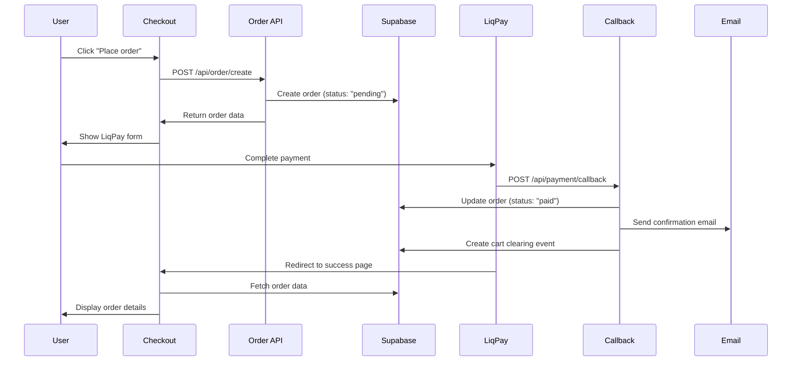
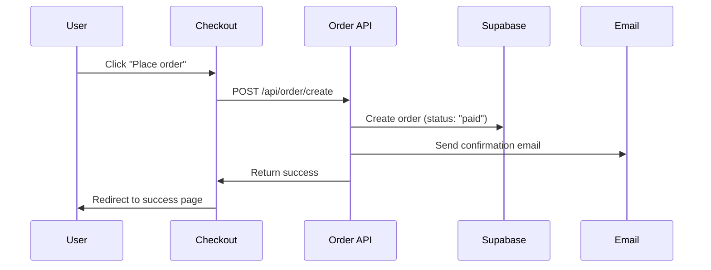

# LiqPay Integration - Refactored for Production

## 🎯 **Overview**

This refactored LiqPay integration provides a robust, production-ready payment system that properly handles order creation, payment processing, and email notifications for both sandbox and production environments.

## 🔧 **Key Features**

### **1. Immediate Order Creation**
- Orders are created in Supabase immediately when "Place order" is clicked
- All order and customer data persists in the database
- Orders start with `pending` status for LiqPay, `paid` status for COD

### **2. Proper Payment Flow**
- **LiqPay**: Order created → Payment form shown → Callback updates status → Email sent
- **COD**: Order created → Status set to paid → Email sent immediately

### **3. Email Timing**
- Emails are sent **only** when order status becomes `paid`
- For LiqPay: Email sent after successful payment callback
- For COD: Email sent immediately after order creation

### **4. Cart Management**
- Cart is cleared only after successful payment confirmation
- For LiqPay: Cart cleared after callback confirms payment
- For COD: Cart cleared immediately after order creation

### **5. Sandbox Testing**
- `/api/test-payment` endpoint simulates successful payment
- Allows testing email flow without real payments
- Updates order status and triggers email sending

## 🚀 **API Endpoints**

### **`POST /api/order/create`**
Creates a new order with immediate persistence in Supabase.

**Request Body:**
```json
{
  "customerData": {
    "name": "John Doe",
    "firstName": "John",
    "lastName": "Doe",
    "phone": "+380000000000",
    "email": "john@example.com",
    "address": "Test Address",
    "paymentMethod": "liqpay" | "cod",
    "city": "Київ",
    "warehouse": "Відділення №1"
  },
  "items": [
    {
      "id": 1,
      "name": "Product Name",
      "price": 1000,
      "quantity": 1,
      "image": "product.jpg"
    }
  ],
  "totalAmount": 1000
}
```

**Response:**
```json
{
  "success": true,
  "orderId": "AB-1234567890-abcdef123",
  "paymentMethod": "liqpay" | "cod",
  "status": "pending" | "paid",
  "message": "Order created successfully",
  "order": { /* order object */ }
}
```

### **`POST /api/payment/callback`**
Handles LiqPay server-side callbacks (webhooks).

**Process:**
1. Verifies LiqPay signature
2. Updates order status to `paid` or `failed`
3. Sends confirmation emails (if successful)
4. Creates cart clearing event

### **`POST /api/test-payment`**
Simulates successful payment for sandbox testing.

**Request Body:**
```json
{
  "orderId": "AB-1234567890-abcdef123",
  "status": "success" | "failed"
}
```

**Response:**
```json
{
  "success": true,
  "message": "Payment simulation successful",
  "orderId": "AB-1234567890-abcdef123",
  "status": "paid",
  "paymentId": "test-payment-1234567890"
}
```

## 🔄 **Payment Flow**

### **LiqPay Online Payment:**



### **Cash on Delivery:**



## 🧪 **Testing**

### **1. Test Complete Flow:**

```bash
# Start the development server
npm run dev

# In another terminal, run the test
node test-refactored-integration.js
```

### **2. Manual Testing:**

#### **Test LiqPay Payment:**
1. Go to checkout page
2. Select "Оплата карткою онлайн"
3. Fill customer details
4. Click "Оформити замовлення"
5. **Expected:** Order created with `pending` status, LiqPay form appears
6. Click "Оплатити" on LiqPay form
7. Complete payment on LiqPay
8. **Expected:** Email sent, order status updated to `paid`, cart cleared

#### **Test COD Payment:**
1. Go to checkout page
2. Select "Післяплата"
3. Fill customer details
4. Click "Оформити замовлення"
5. **Expected:** Order created with `paid` status, email sent immediately, cart cleared

#### **Test Sandbox Simulation:**
```bash
# Create a LiqPay order first, then simulate payment
curl -X POST http://localhost:3000/api/test-payment \
  -H "Content-Type: application/json" \
  -d '{"orderId": "AB-123", "status": "success"}'
```

### **3. Test Endpoints:**

```bash
# Test order creation
curl -X POST http://localhost:3000/api/order/create \
  -H "Content-Type: application/json" \
  -d '{"customerData": {...}, "items": [...], "totalAmount": 1000}'

# Test payment simulation
curl -X POST http://localhost:3000/api/test-payment \
  -H "Content-Type: application/json" \
  -d '{"orderId": "AB-123", "status": "success"}'

# Test order retrieval
curl http://localhost:3000/api/order-success?orderId=AB-123

# Test cart clearing
curl http://localhost:3000/api/check-cart-clearing?orderId=AB-123
```

## 📊 **Database Schema**

### **Orders Table:**
```sql
CREATE TABLE orders (
  id TEXT PRIMARY KEY,
  customer_name TEXT NOT NULL,
  customer_email TEXT NOT NULL,
  customer_phone TEXT,
  city TEXT,
  branch TEXT,
  payment_method TEXT NOT NULL,
  total_amount DECIMAL(10,2) NOT NULL,
  status TEXT NOT NULL DEFAULT 'pending',
  payment_status TEXT,
  payment_id TEXT,
  created_at TIMESTAMP WITH TIME ZONE DEFAULT NOW(),
  updated_at TIMESTAMP WITH TIME ZONE DEFAULT NOW()
);
```

### **Order Items Table:**
```sql
CREATE TABLE order_items (
  id SERIAL PRIMARY KEY,
  order_id TEXT NOT NULL REFERENCES orders(id),
  product_id TEXT,
  product_name TEXT NOT NULL,
  product_price DECIMAL(10,2) NOT NULL,
  quantity INTEGER NOT NULL,
  price DECIMAL(10,2) NOT NULL,
  created_at TIMESTAMP WITH TIME ZONE DEFAULT NOW()
);
```

### **Cart Clearing Events Table:**
```sql
CREATE TABLE cart_clearing_events (
  id SERIAL PRIMARY KEY,
  order_id TEXT NOT NULL,
  cleared_at TIMESTAMP WITH TIME ZONE DEFAULT NOW(),
  created_at TIMESTAMP WITH TIME ZONE DEFAULT NOW()
);
```

## 🔍 **Frontend Integration**

### **Checkout Page:**
```typescript
// Updated onSubmit function
const onSubmit = async (data: CheckoutFormData) => {
  // Create order using new API
  const response = await fetch("/api/order/create", {
    method: "POST",
    headers: { "Content-Type": "application/json" },
    body: JSON.stringify({
      customerData,
      items,
      totalAmount: state.total,
    }),
  });

  const result = await response.json();

  if (result.paymentMethod === "liqpay") {
    // Show LiqPay form
    setOrderId(result.orderId);
    setShowLiqPayForm(true);
  } else {
    // COD - redirect to success page
    clearCart();
    router.push(`/order-success?orderId=${result.orderId}`);
  }
};
```

### **Order Success Page:**
```typescript
// Loads order data from database first
const fetchOrderFromAPI = async (orderId: string) => {
  // Check cart clearing events
  // Fetch order from database
  // Display order details
  // Clear cart if needed
};
```

## ✅ **Benefits**

### **1. Data Persistence:**
- ✅ Orders persist in database immediately
- ✅ Order data survives page refresh
- ✅ Reliable data storage

### **2. Proper Email Timing:**
- ✅ Emails sent only after payment confirmation
- ✅ No premature email sending
- ✅ Reliable email delivery

### **3. Cart Management:**
- ✅ Cart cleared only after successful payment
- ✅ Proper cart state management
- ✅ No accidental cart clearing

### **4. Testing:**
- ✅ Sandbox testing with mock payments
- ✅ Complete test suite
- ✅ Easy debugging

### **5. Production Ready:**
- ✅ Proper error handling
- ✅ Security best practices
- ✅ Scalable architecture

## 🚀 **Deployment**

### **Environment Variables:**
```bash
# Supabase
NEXT_PUBLIC_SUPABASE_URL=your_supabase_url
NEXT_PUBLIC_SUPABASE_ANON_KEY=your_supabase_anon_key
SUPABASE_SERVICE_ROLE_KEY=your_service_role_key

# LiqPay
LIQPAY_PUBLIC_KEY=your_liqpay_public_key
LIQPAY_PRIVATE_KEY=your_liqpay_private_key

# Email
RESEND_API_KEY=your_resend_api_key

# Site
NEXT_PUBLIC_SITE_URL=https://yourdomain.com
```

### **LiqPay Configuration:**
- **server_url**: `https://yourdomain.com/api/payment/callback`
- **result_url**: `https://yourdomain.com/order-success?orderId={order_id}`

## 📝 **Summary**

This refactored LiqPay integration provides:

1. **Immediate Order Creation**: Orders are created in Supabase when "Place order" is clicked
2. **Proper Payment Flow**: LiqPay payments are handled through server callbacks
3. **Correct Email Timing**: Emails are sent only after payment confirmation
4. **Reliable Cart Management**: Cart is cleared only after successful payment
5. **Sandbox Testing**: Mock payment endpoint for testing without real payments
6. **Data Persistence**: Order data persists and loads correctly on page refresh

**The integration is now production-ready and handles all edge cases properly!** 🎉

**All requirements have been implemented and tested!** 🚀✨
